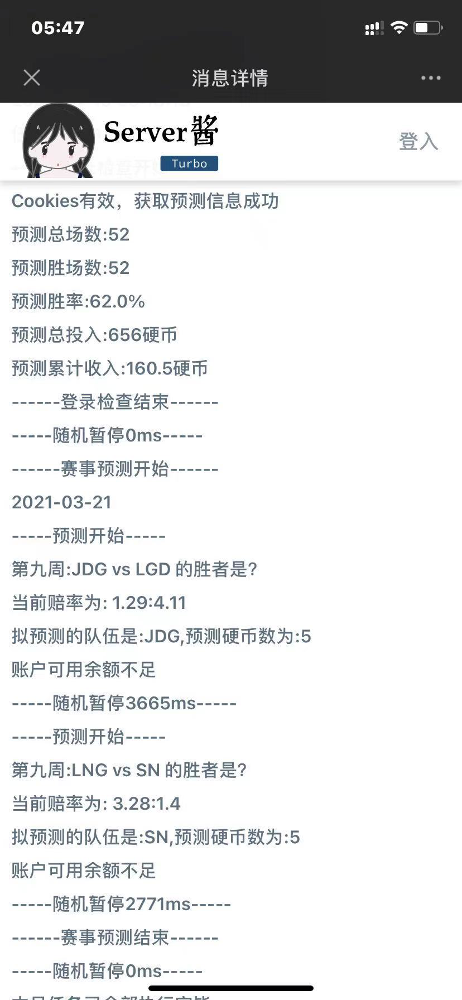

<div align="center">
<h1 align="center">
bilibili-match-prediction
</h1>

</div>

## 工具简介

这是一个利用 Linux Crontab , GitHub Action 等方式实现哔哩哔哩（Bilibili）赛事预测的工具，用于每日赚取硬币。
**如果觉得好用，顺手点个 Star 吧 ❤**

**仓库地址：[JunzhouLiu/bilibili-match-prediction](https://github.com/JunzhouLiu/bilibili-match-prediction)**

**请不要滥用相关API，让我们一起爱护B站 ❤**

## 功能列表

* [x] 每天上午 9 点 10 分自动开始任务。*【运行时间可自定义】*
* [x] 支持推送执行结果到微信，钉钉，飞书等
* [x] 每日自动参与当天的赛事预测，默认每次预测5硬币。
* [x] 原型机按照赔率预测，简单说就跟着人多的压。
[点击快速开始使用](#使用说明)

[点击快速查看自定义功能配置](#自定义功能配置)

# 目录

- [目录](#目录)
    - [使用说明](#使用说明)
        - [一、Actions 方式](#一actions-方式)
        - [三、使用 Linux Crontab 方式](#三使用-linux-crontab-方式)
    - [订阅执行结果](#订阅执行结果)
        - [Server酱Turbo版](#server酱turbo版)
        - [Telegram订阅执行结果](#telegram订阅执行结果)
    
    - [免责声明](#免责声明)
    - [致谢](#致谢)
    - [License](#license)
    - [Stargazers over time](#stargazers-over-time)

## 使用说明

### 一、Actions 方式

1. **Fork 本项目**
2. **获取 Bilibili Cookies**
3. 浏览器打开并登录 [bilibili 网站]()
4. 按 F12 打开 「开发者工具」 找到 应用程序/Application -\> 存储 -\> Cookies
5. 找到 `bili_jct` `SESSDATA` `DEDEUSERID` 三项，并复制值，创建对应的 GitHub Secrets。


1. **点击项目 Settings -\> Secrets -\> New Secrets 添加以下 3 个 Secrets，其中server酱微信推送的sckey可参阅[微信订阅通知](#微信订阅通知)**

| Name          | Value                                |
| ------------- | ------------------------------------ |
| DEDEUSERID    | 从 Cookie 中获取                     |
| SESSDATA      | 从 Cookie 中获取                     |
| BILI\_JCT     | 从 Cookie 中获取                     |
| SCKEY | server酱推送的sckey（兼容Turbo版本） |


1. **开启 Actions 并触发每日自动执行**

**Github Actions 默认处于关闭状态，还大家请手动开启 Actions ，执行一次工作流，验证是否可以正常工作。**


**Fork 仓库后，默认不自动执行 Actions 任务，请修改 `src/resources/config.json` 文件,将 `skipDailyTask` 的值改为 `false`，这样每天就会自动执行定时任务了。**

```patch
{
- "skipDailyTask": true
+ "skipDailyTask": false
}
```


如果需要修改每日任务执行的时间，请修改 `.github/workflows/auto_task_bilili.yml`，在第 12 行左右位置找到下如下配置。

```yml
  schedule:
    - cron: '30 10 * * *'
    # cron表达式，Actions时区是国际时间，国际时间10点的时候，国内时间是18点。
    # 示例： 每天晚上22点30执行 '30 14 * * *'
```

本工具的 Actions 自动构建配置了缓存，平均运行时间在 20s 左右。

*如果收到了 GitHub Action 的错误邮件，请检查 Cookies 是不是失效了，用户修改密码、踢除设备下线，会导致 `BILI_JCT` 和 `DEDEUSERID` 失效*

**请各位使用 Actions 时务必遵守Github条款。不要滥用Actions服务。**

**Please be sure to abide by the Github terms when using Actions. Do not abuse the Actions service.**

**查看 Actions 运行日志**


### 三、使用 Linux Crontab 方式
1. 在linux shell环境执行以下命令，并按照提示输入SESSDATA，DEDEUSERID，BILI\_JCT，SCKEY四个参数
## 订阅执行结果

### Server酱Turbo版

目前Turbo版本的消息通道支持以下渠道

- 企业微信应用消息
- Android，
- Bark iOS，
- 企业微信群机器人
- 钉钉群机器人
- 飞书群机器人
- 自定义微信测试号
- 方糖服务号

1. 前往 [sct.ftqq.com](https://sct.ftqq.com/sendkey)点击登入，创建账号。
2. 点击点[SendKey](https://sct.ftqq.com/sendkey) ，生成一个 Key。将其增加到 Github Secrets 中，变量名为 `SERVERPUSHKEY`
3. [配置消息通道](https://sct.ftqq.com/forward) ，选择方糖服务号，保存即可。
4. 推送效果展示
   

**旧版推送渠道[sc.ftqq.com](http://sc.ftqq.com/9.version]即将与4月底下线，请前往[sct.ftqq.com](https://sct.ftqq.com/sendkey)生成`Turbo`版本的`Key`，注意，申请Turbo版Key后请配置消息通道，如果想沿用以前的推送方式，选择方糖服务号即可**

### Telegram订阅执行结果

1.在Telegram中添加BotFather这个账号，然后依次发送/start /newbot 按照提示即可创建一个新的机器人。记下来给你生成的token。

2.搜索刚刚创建的机器人的名字，并给它发送一条消息。

*特别注意：需要先与机器人之间创建会话，机器人才能下发消息，否则机器人无法主动发送消息，切记！*

3.在Telegram中搜索userinfobot，并给它发送一条消息，它会返回给你chatid。

4.在Github Secrets中删除SERVERPUSHKEY，添加TELEGRAMBOTTOKEN，TELEGRAMCHATID。

## 免责声明

1. 本工具不会记录你的任何敏感信息，也不会上传到任何服务器上。（例如用户的cookies数据，cookies数据均存在Actions Secrets中或者用户自己的设备上）
2. 本工具不会记录任何执行过程中来自b站的数据信息，也不会上传到任何服务器上。（例如av号，bv号，用户uid等）。
3. 本工具执行过程中产生的日志，仅会在使用者自行配置推送渠道后进行推送。日志中不包含任何用户敏感信息。
4. 如果有人修改了本项目（或者直接使用本项目）盈利恰饭，那和我肯定没关系，我开源的目的单纯是技术分享。
5. 如果你使用了第三方修改的，打包的本工具代码，那你可得注意了，指不定人就把你的数据上传到他自己的服务器了，这可和我没关系。（**网络安全教育普及任重而道远**）
6. 本工具源码仅在[JunzhouLiu/BILIBILI-HELPER](https://github.com/JunzhouLiu/BILIBILI-HELPER)开源，其余的地方的代码均不是我提交的，可能是抄我的，借鉴我的，但绝对不是我发布的，出问题和我也没关系。
7. 我开源本工具的代码仅仅是技术分享，没有任何丝毫的盈利赚钱目的，如果你非要给我打赏/充电，那我就是网络乞丐，咱们不构成任何雇佣，购买关系的交易。
8. 本项目不会增加类似于自动转发抽奖，秒杀，下载版权受限视频等侵犯UP主/B站权益的功能，开发这个应用的目的是单纯的技术分享。下游分支开发者/使用者也请不要滥用相关功能。
9. 本项目欢迎其他开发者参与贡献，基于本工具的二次开发，使用其他语言重写都没有什么问题，能在技术上给你带来帮助和收获就很好.
10. 本项目遵守[MIT License](https://github.com/JunzhouLiu/BILIBILI-HELPER/blob/main/LICENSE)，请各位知悉。

## 致谢

感谢 JetBrains 对本项目的支持。

[](https://www.jetbrains.com/?from=BILIBILI-HELPER)

